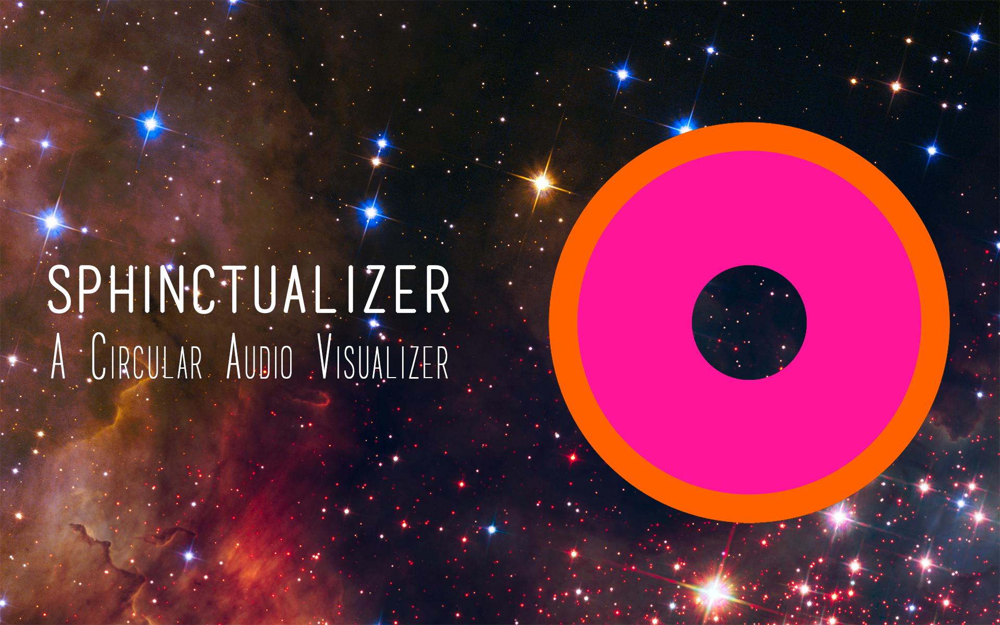

# Sphinctualizer
Sphinctualizer is a circular audio visualizer for [Rainmeter](https://www.rainmeter.net/), consisting of two rings that change diameter and size based on the sound. It was made with inspiration from the end credits animations of [Bizzaro Studio](https://www.youtube.com/user/TheBayrShow) on YouTube.

## Installation

1. [Download the rmskin-package](Packaged/Sphinctualizer_1.0.rmskin?raw=true)
2. Open it in [Rainmeter](https://www.rainmeter.net/)
3. Choose variant: Large (max 1200 px), Medium (max 600 px) or Small (max 300 px)

## Demo

The animation below shows how the Sphinctualizer looks while a song is playing.

## Learn More

* [Packaging Information](docs/packaging-information.md)
* [Customize the Sphinctualizer](docs/customize-the-sphinctualizer.md)

## Contributor

* Gustav Blomér ([@garnesson](https://github.com/garnesson))

## Credits

* Inspiration from [Bizzaro Studio](https://www.youtube.com/user/TheBayrShow) on YouTube
* **Font**: [Basic Title Font](http://www.dafont.com/basic-title-font.font) by [Przemyslaw Hoffer](http://www.dafont.com/przemyslaw-hoffer.d4259)
* The photography above of the star cluster [Westerlund 2](http://hubblesite.org/newscenter/archive/releases/2015/12/) is Public Domain, but credited to the following:
	* [NASA](http://www.nasa.gov/), [ESA](http://www.spacetelescope.org/), the [Hubble Heritage](http://heritage.stsci.edu/) Team ([STScI](http://www.stsci.edu/)/[AURA](http://www.aura-astronomy.org/)), A. Nota  ([ESA](http://www.spacetelescope.org/)/[STScI](http://www.stsci.edu/)), and the Westerlund 2 Science Team
